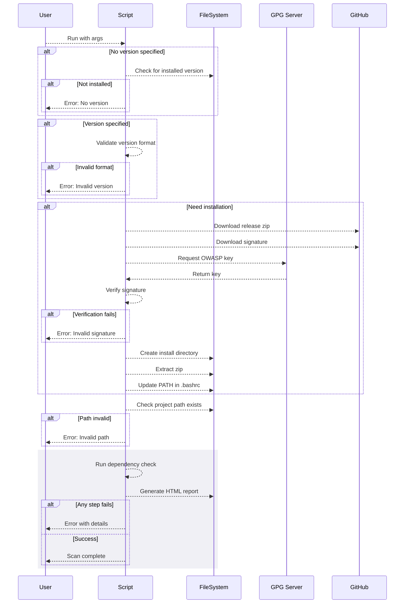

# Shuttle Linux - File Transfer and Malware Scanning Script

**Note:** This script is under active development and has not been fully tested. Use at your own risk.

`shuttle-linux.py` is a Python script designed to transfer files from a source directory to a destination directory on Linux systems. It includes malware scanning using Microsoft Defender ATP (`mdatp`), handling of infected files, and supports parallel processing for efficiency.

## **Features**

- **File Transfer from Source to Destination:**
  - Copies files from the source directory to a quarantine directory while ensuring files are stable and not being written to.
  - Moves clean files from the quarantine directory to the destination directory after scanning.

- **Malware Scanning:**
  - Utilizes `mdatp` to scan each file individually for malware.
  - Supports parallel scanning with a configurable number of concurrent scans.

- **Handling Infected Files:**
  - If malware is detected, files are compressed and encrypted using a provided password.
  - Encrypted archives are moved to a specified hazard archive directory for further analysis.
  - If hazard archive parameters are not provided, infected files are deleted.

- **File Integrity Verification:**
  - Verifies that the source and destination files match by comparing their hashes.
  - Ensures data integrity during the transfer process.

- **Concurrency and Performance:**
  - Uses `ProcessPoolExecutor` to scan and process files in parallel.
  - Limits the number of concurrent scans to optimize resource usage.

- **Single Instance Enforcement:**
  - Implements a lock file mechanism to prevent multiple instances of the script from running simultaneously.

- **Configuration via Command-Line Arguments or Settings File:**
  - Supports specifying paths and options through command-line arguments.
  - Can load settings from a configuration file if arguments are not provided.

## **Prerequisites**

### **System Dependencies**

- **Python 3**: Programming language used to run the script (version >= 3.6).
- **pip**: Python package installer.
- **lsof**: Utility to check if files are open by any processes.
- **zip**: Utility for compressing and encrypting files.
- **mdatp**: Microsoft Defender ATP command-line tool for malware scanning.

**Note:** The script will check for the availability of these external commands at runtime. If any are missing, it will log an error and exit.

### **Installation of External Commands**

Ensure that the following commands are installed and accessible in your system's PATH:

- **lsof**:
  - Install via package manager:
    ```bash
    sudo apt-get install lsof  # For Debian/Ubuntu
    ```
- **zip**:
  - Install via package manager:
    ```bash
    sudo apt-get install zip  # For Debian/Ubuntu
    ```
- **mdatp**:
  - **Official Installation Guide**:
    - [Install Microsoft Defender for Endpoint on Linux Manually](https://learn.microsoft.com/en-us/microsoft-365/security/defender-endpoint/linux-install-manually)
  - **Note**: `mdatp` requires manual installation following Microsoft's official guide due to licensing agreements and repository setup.

### **Installation Script**

To install all the necessary system packages and Python dependencies, you can use the provided `install_dependencies.sh` script.

#### **Install Dependencies Script**

#### **Running the Installation Script**

- **Make the Script Executable:**

   ```bash
   chmod +x install_dependencies.sh
   ```

- **Run the Script:**

   ```bash
   ./install_dependencies.sh
   ```

#### **Create and Activate a Virtual Environment**

- **Create a Virtual Environment:**

   ```bash
   python3 -m venv venv
   ```

- **Activate the Virtual Environment:**

   ```bash
   source venv/bin/activate
   ```

- **Install Python Packages:**

   After activating the virtual environment, install the Python packages specified in `requirements.txt`:

   ```bash
   pip install -r requirements.txt
   ```

### **Install `mdatp`**

`mdatp` requires manual installation following Microsoft's official guide due to licensing agreements and repository setup.

**Official Installation Guide:**

- [Install Microsoft Defender for Endpoint on Linux Manually](https://learn.microsoft.com/en-us/microsoft-365/security/defender-endpoint/linux-install-manually)

### **Password Management**

The script uses `python-keyring` to securely store and retrieve the hazard archive password.

- **Store the Password:**

   Use the `store_password.py` script to store the hazard archive password in the keyring.

  ```bash
  python3 store_password.py
  ```

  You will be prompted to enter the password twice for confirmation.

- **Command-Line Override:**

  You can override the keyring password by providing the `-HazardArchivePassword` argument when running the script.

### **Usage**

```bash
python3 shuttle-linux.py \
    -SourcePath /path/to/source \
    -DestinationPath /path/to/destination \
    -QuarantinePath /path/to/quarantine \
    -QuarantineHazardArchive /path/to/hazard_archive \
    -HazardArchivePassword your_secure_password \
    --max-scans 4 \
    -DeleteSourceFilesAfterCopying
```

### **Command-Line Arguments:**

- `-SourcePath`: Path to the source directory containing files to transfer.
- `-DestinationPath`: Path to the destination directory where clean files will be moved.
- `-QuarantinePath`: Path to the quarantine directory used for scanning.
- `-SettingsPath`: Path to the settings file (default: `~/.shuttle/settings.ini`).
- `-TestSourceWriteAccess`: Test write access to the source directory.
- `-DeleteSourceFilesAfterCopying`: Delete the source files after successful transfer.
- `--max-scans`: Maximum number of parallel scans.
- `--lock-file`: Path to the lock file to prevent multiple instances (default: `/tmp/shuttle.lock`).
- `-QuarantineHazardArchive`: Path to the hazard archive directory for infected files.
- `-HazardArchivePassword`: Password for encrypting the hazard archive (overrides keyring).
- `-LogLevel`: Logging level (DEBUG, INFO, WARNING, ERROR, CRITICAL). Default is INFO.

### **Settings File (`settings.ini`):**

If command-line arguments are not provided, the script will attempt to read from a settings file in INI format. An example `settings.ini` might look like:

```ini
[Paths]
SourcePath=/path/to/source
DestinationPath=/path/to/destination
QuarantinePath=/path/to/quarantine
LogPath=/path/to/logs
QuarantineHazardArchive=/path/to/hazard_archive

[Settings]
MaxScans=4
DeleteSourceFilesAfterCopying=True

[Logging]
LogLevel=DEBUG
```

**Note:** The script gives priority to command-line arguments over the settings 
file.

**Note:** The `LogLevel` can be set to `DEBUG`, `INFO`, `WARNING`, `ERROR`, or `CRITICAL` depending on the desired verbosity.

**Hazard Archive Password:** The password is stored in the operating system keyring. The primary use for this password is to require a manual confirmation before opening an archive that may contain malware. If you require alternative storage of the password to protect these archives, please modify the script to integrate with your secrets vault.

### **Example Workflow:**

1. **Set Up Test Environment:**

   Use the provided `setup_test_environment_linux.py` script to create test directories and files.

   ```bash
   python3 setup_test_environment_linux.py
   ```

2. **Run the Shuttle Script:**

   Execute `shuttle-linux.py` with the desired parameters or ensure the `settings.ini` file is properly configured.

   ```bash
   python3 shuttle-linux.py
   ```

3. **Script Operations:**

   - The script copies files from the source to the quarantine directory, skipping files that are unstable or open.
   - Files in the quarantine directory are scanned in parallel.
     - Clean files are moved to the destination directory.
     - Infected files are compressed, encrypted, and moved to the hazard archive.
   - Source files are optionally deleted after successful processing.
   - The quarantine directory is cleaned up after processing.

4. **Review Results:**

   - Check the destination directory for transferred files.
   - Examine the hazard archive for any infected files, if applicable.
   - Verify logs and output messages for any errors or issues.

## **Important Notes**

- **Security Considerations:**

  - Handle passwords securely; avoid exposing them in scripts or command-line arguments when possible.
  - Ensure only authorized users have access to the script and the directories involved.

- **Error Handling:**

  - The script includes basic error handling but may require enhancements for production use.
  - Logs and messages should be reviewed to identify and address any issues.

- **Testing and Validation:**

  - Thoroughly test the script in a controlled environment before deploying it in production.
  - Validate that all operations perform as expected and that files are transferred securely.

- **Limitations:**

  - The script assumes that `mdatp` is installed and operational.
  - The `zip` utility's encryption may not meet all security requirements; consider using stronger encryption methods if necessary.

## **Contributing and Feedback**

This script is a work in progress. Contributions, suggestions, and feedback are welcome to improve its functionality and reliability.

---

## **Additional Commands and Tips**

Here are some additional `mdatp` commands that may be useful:

```bash
# Check health status
mdatp health

# Update definitions
mdatp definition update

# List detected threats
mdatp threat list

# Perform a quick scan
mdatp scan quick

# Perform a full scan
mdatp scan full

# Configure telemetry settings
mdatp config telemetry --value-enabled  # Enable telemetry
mdatp config telemetry --value-disabled # Disable telemetry
```

Feel free to explore the `mdatp` command-line options to better understand its capabilities.

## **Project Structure**

An example project directory structure:

```
/your_project/
├── shuttle-linux.py
├── setup_test_environment_linux.py
├── install_dependencies.sh
├── health_check.sh
├── create_venv.sh
├── store_password.py
├── requirements.txt
├── settings.ini
├── readme.md
└── ... (other files)
```

Ensure all scripts have the correct permissions:

```bash
chmod +x shuttle-linux.py
chmod +x setup_test_environment_linux.py
chmod +x install_dependencies.sh
chmod +x health_check.sh
chmod +x create_venv.sh
chmod +x store_password.py
```

---

Please refer to this `readme.md` for detailed instructions on setting up, configuring, and running the `shuttle-linux.py` script.



    


        


