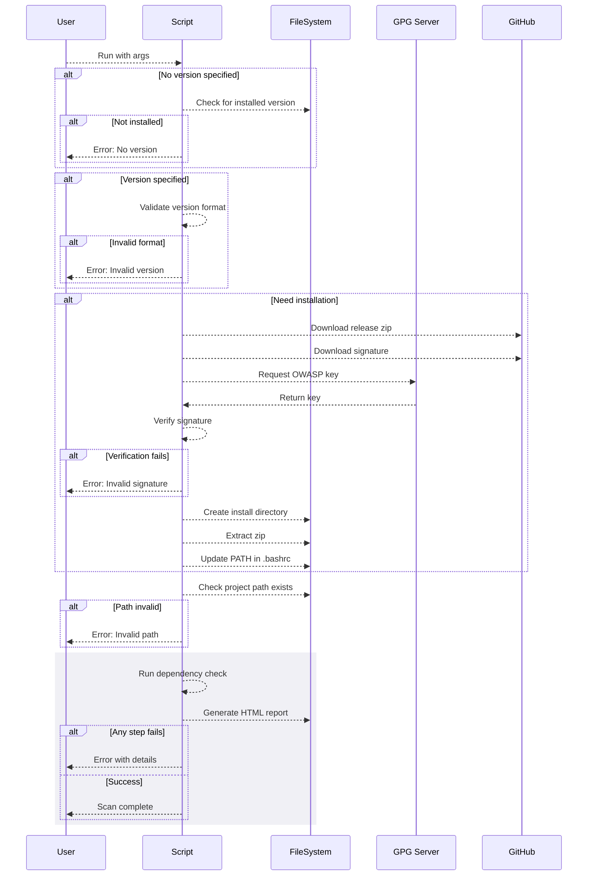
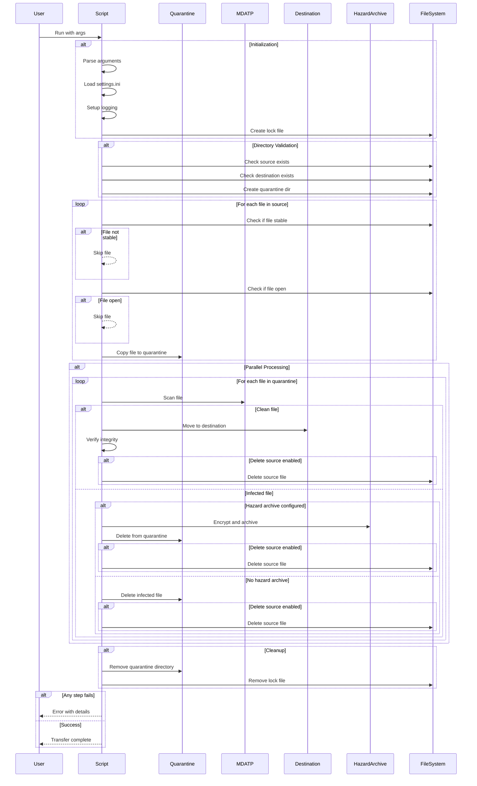

# Shuttle Linux - File Transfer and Malware Scanning Script

**Note:** This script is under active development and has not been fully tested. Use at your own risk.

`shuttle-linux.py` is a Python script designed to transfer files from a source directory to a destination directory on Ubuntu Linux systems. It includes malware scanning using Microsoft Defender ATP (`mdatp`), handling of infected files, and supports parallel processing for efficiency. It may work on other Linux distributions however the installation scripts were written for ubuntu, and you will need to check that Microsoft Defender is supported on your distribution.

## **Features**

- **File Transfer from Source to Destination:**
  - Copies files from the source directory to a quarantine directory while ensuring files are stable and not being written to.
  - Moves clean files from the quarantine directory to the destination directory after scanning.

- **Malware Scanning:**
  - Utilizes `mdatp` to scan each file individually for malware.
  - Supports parallel scanning with a configurable number of concurrent scans.

- **Handling Infected Files:**
  - If malware is detected, files are encrypted using GPG with a public key
  - Encrypted files are moved to a specified hazard archive directory for further analysis
  - If hazard archive parameters are not provided, infected files are deleted

- **File Integrity Verification:**
  - Verifies that the source and destination files match by comparing their hashes.
  - Ensures data integrity during the transfer process.

- **Concurrency and Performance:**
  - Uses `ProcessPoolExecutor` to scan and process files in parallel.
  - Limits the number of concurrent scans to optimize resource usage.

- **Single Instance Enforcement:**
  - Implements a lock file mechanism to prevent multiple instances of the script from running simultaneously.

- **Configuration via Command-Line Arguments or Settings File:**
  - Supports specifying paths and options through command-line arguments.
  - Can load settings from a configuration file if arguments are not provided.


## **Generate encryption keys**
  Run this script on a different machine. It will generate two keys
  - a public key  :   ~/.shuttle/hazard_public.gpg
  - a private key :   ~/.shuttle/hazard_private.gpg


   ```bash
   ./00_generate_shuttle_keys.sh
   ```

Keep these keys somewhere secure.
If you lose the private key you will not be able to decrypt files suspected of containing malware.

Copy only the public key ~/.shuttle/hazard_public.gpg to the server

DO NOT put the private key ~/.shuttle/hazard_private.gpg on the server

## **Installation Scripts**

To install all the necessary system packages and Python dependencies, you can use the provided scripts.
Run these scripts from the application root.

- **First make the scripts executable:**

   ```bash
   chmod +x ./*.sh
   ```

   ```bash
   chmod +x ./*.py
   ```

- **Run the Scripts:**

- **Install required supporting applications**
  
   ```bash
   ./01_install_dependencies.sh
   ```

**Note:** The script will check for the availability of these external commands at runtime. If any are missing, it will log an error and exit.

The script ensures that the following commands are installed and accessible in your system's PATH:

- **lsof**:
  - Install via package manager:
    ```bash
    sudo apt-get install lsof  # For Debian/Ubuntu
    ```
    
- **gpg**:
  - Install via package manager:
- 
    ```bash
    sudo apt-get install gnupg  # For Debian/Ubuntu
    ```
  - Verify installation:
  
    ```bash
    gpg --version
    ```
  - Note: GPG is typically pre-installed on most Linux distributions but may need updating.

- **mdatp**:
    If Microsoft Defender is not installed on your machine read the Microsoft installation Guide for further information:
  - **Official Installation Guide**:
    - [Install Microsoft Defender for Endpoint on Linux Manually](https://learn.microsoft.com/en-us/microsoft-365/security/defender-endpoint/linux-install-manually)
  - **Note**: `mdatp` requires manual installation following Microsoft's official guide due to licensing agreements and repository setup.


- **Set up python:**
  
   ```bash
   ./02_install_python.sh
   ```

- **Create a Virtual Environment:**

   ```bash
   ./03_create_venv.sh
   ```

  This script sets up a python virtual environment

  ```bash
   python3 -m venv venv
   ```


- **Activate virtual environment**
  
   ```bash
   source ./04_activate_venv_CALL_BY_SOURCE.sh
   ```

  The virtual environment must be activated, this is what the script does:

  ```bash
   source venv/bin/activate
   ```
   - **Set up python dependencies**

   ```bash
   ./05_install_python_dependencies.sh
   ```

    After activating the virtual environment, this script installs the Python packages specified in `requirements.txt`:

   ```bash
   pip install -r requirements.txt
   ```


   - **Set up working environment config**
  
  This script sets up working files, a settings file and creates a global scope exception for the working folder to stop automatic Microsoft Defender scans interfering with the scripted scanning process.
  If you do not have permission to change exceptions on your machine this process will not work

  ```bash
   python3 ./06_setup_test_environment_linux.py

   ```

## Running the script

Make sure the virtual environment is active.
You do not need to provide parameters if parameters are configured in the settings file
If you do not configure a hazard archive directory and an encryption key, suspect files will be deleted.

```bash
python3 shuttle-linux.py \
    -SourcePath /path/to/source \
    -DestinationPath /path/to/destination \
    -QuarantinePath /path/to/quarantine \
    -HazardArchivePath /path/to/hazard_archive \
    -HazardEncryptionKeyPath /path/to/shuttle_public.gpg \
    --max-scans 4 \
    -DeleteSourceFilesAfterCopying
```

### **Command-Line Arguments:**

- `-SourcePath`: Path to the source directory containing files to transfer.
- `-DestinationPath`: Path to the destination directory where clean files will be moved.
- `-QuarantinePath`: Path to the quarantine directory used for scanning.
- `-SettingsPath`: Path to the settings file (default: `~/.shuttle/settings.ini`).
- `-TestSourceWriteAccess`: Test write access to the source directory.
- `-DeleteSourceFilesAfterCopying`: Delete the source files after successful transfer.
- `--max-scans`: Maximum number of parallel scans.
- `--lock-file`: Path to the lock file to prevent multiple instances (default: `/tmp/shuttle.lock`).
- `-HazardArchivePath`: Path to store encrypted infected files
- `-HazardEncryptionKeyPath`: Path to the GPG public key file for encrypting hazard files
- `-LogLevel`: Logging level (DEBUG, INFO, WARNING, ERROR, CRITICAL). Default is INFO.

### **Settings File (`settings.ini`):**

If command-line arguments are not provided, the script will attempt to read from a settings file in INI format. An example `settings.ini` might look like:

```ini
[Paths]
SourcePath=/path/to/source
DestinationPath=/path/to/destination
QuarantinePath=/path/to/quarantine
LogPath=/path/to/logs
HazardArchivePath=/path/to/hazard_archive
HazardEncryptionKeyPath=/path/to/shuttle_public.gpg

[Settings]
MaxScans=4
DeleteSourceFilesAfterCopying=True

[Logging]
LogLevel=DEBUG
```

**Note:** The script gives priority to command-line arguments over the settings 
file.

**Note:** The `LogLevel` can be set to `DEBUG`, `INFO`, `WARNING`, `ERROR`, or `CRITICAL` depending on the desired verbosity.

### **Example Workflow:**

1. **Set Up Test Environment:**

   Use the provided `setup_test_environment_linux.py` script to create test directories and files.

   ```bash
   python3 setup_test_environment_linux.py
   ```

2. **Run the Shuttle Script:**

   Execute `shuttle-linux.py` with the desired parameters or ensure the `settings.ini` file is properly configured.

   ```bash
   python3 shuttle-linux.py
   ```

3. **Script Operations:**

   - The script copies files from the source to the quarantine directory, skipping files that are unstable or open.
   - Files in the quarantine directory are scanned in parallel.
     - Clean files are moved to the destination directory.
     - Infected files are encrypted and moved to the hazard archive.
   - Source files are optionally deleted after successful processing.
   - The quarantine directory is cleaned up after processing.

4. **Review Results:**

   - Check the destination directory for transferred files.
   - Examine the hazard archive for any infected files, if applicable.
   - Verify logs and output messages for any errors or issues.

## **Important Notes**

- **Security Considerations:**

  - Handle passwords securely; avoid exposing them in scripts or command-line arguments when possible.
  - Ensure only authorized users have access to the script and the directories involved.

- **Error Handling:**

  - The script includes basic error handling but may require enhancements for production use.
  - Logs and messages should be reviewed to identify and address any issues.

- **Testing and Validation:**

  - Thoroughly test the script in a controlled environment before deploying it in production.
  - Validate that all operations perform as expected and that files are transferred securely.

- **Limitations:**

  - The script assumes that `mdatp` is installed and operational.


## **Contributing and Feedback**

This script is a work in progress. Contributions, suggestions, and feedback are welcome to improve its functionality and reliability.

---

## **Additional Commands and Tips**

Here are some additional `mdatp` commands that may be useful:

```bash
# Check health status
mdatp health

# Update definitions
mdatp definition update

# List detected threats
mdatp threat list

# Perform a quick scan
mdatp scan quick

# Perform a full scan
mdatp scan full

# Configure telemetry settings
mdatp config telemetry --value-enabled  # Enable telemetry
mdatp config telemetry --value-disabled # Disable telemetry
```

Feel free to explore the `mdatp` command-line options to better understand its capabilities.

## **Project Structure**

An example project directory structure:

```
/your_project/
├── shuttle-linux.py
├── setup_test_environment_linux.py
├── 01_install_dependencies.sh
├── 02_health_check.sh
├── 03_create_venv.sh
├── 04_setup_owasp_check.sh
├── 05_generate_keys.sh
├── requirements.txt
├── settings.ini
├── readme.md
└── ... (other files)
```

Ensure all scripts have the correct permissions:

```bash
chmod +x shuttle-linux.py
chmod +x setup_test_environment_linux.py
chmod +x 01_install_dependencies.sh
chmod +x 02_health_check.sh
chmod +x 03_create_venv.sh
chmod +x 04_setup_owasp_check.sh
chmod +x 05_generate_keys.sh
```

### **Key Management**

The script uses GPG encryption for securing hazard files. You'll need to:

1. **Generate Key Pair**:
   ```bash
   ./generate_keys.sh
   ```
   This will create:
   - `shuttle_public.gpg`: Public key for encrypting hazard files
   - `shuttle_private.gpg`: Private key for decryption (keep secure!)

2. **Key Deployment**:
   - Deploy ONLY the public key (`shuttle_public.gpg`) to production machines
   - Keep the private key secure and OFF the production machine
   - Store the private key securely for later decryption of hazard files

3. **Security Considerations**:
   - Never deploy the private key to production environments
   - Keep the private key backed up securely
   - Only systems that need to decrypt hazard files should have access to the private key
   - The production system only needs the public key for encryption

4. **Configuration**:
   Update your settings.ini with the path to the public key:
   ```ini
   [Settings]
   HazardEncryptionKeyFile = /path/to/shuttle_public.gpg
   ```

**Note:** The separation of public and private keys ensures that even if the production system is compromised, encrypted hazard files cannot be decrypted without access to the private key stored elsewhere.

---

Please refer to this `readme.md` for detailed instructions on setting up, configuring, and running the `shuttle-linux.py` script.



    





        


